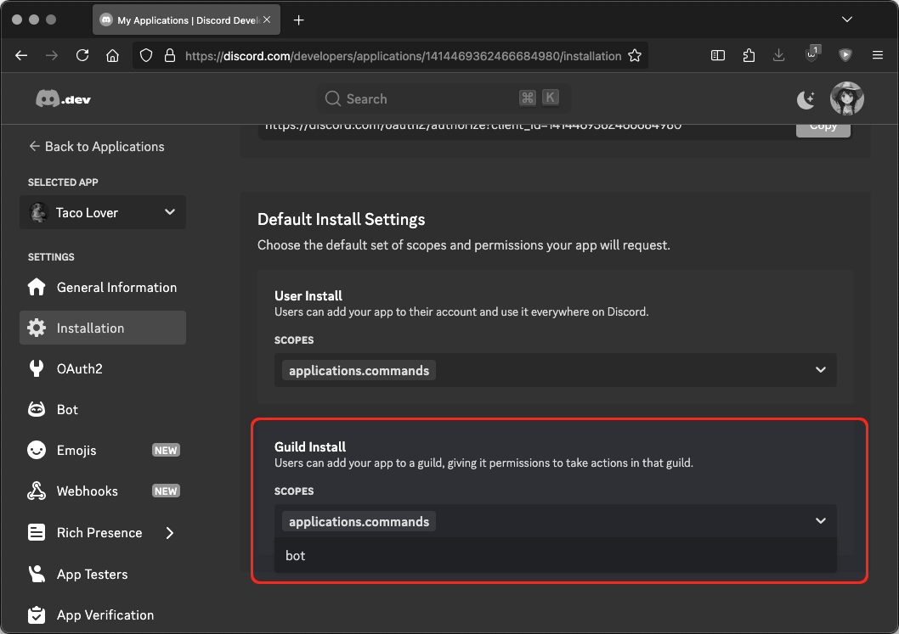

# Register with Discord

The first step in getting PBot running is registering your private bot with
Discord to obtain an API key. Navigate to the
[Discord Developer Portal](https://discord.com/developers/applications).

## Create a New Application

Click on the **New Application** button to start the process of registering your bot.

<figure markdown="span">
	
	<figcaption>
	Default Empty Applications Page
	</figcaption>
</figure>

## Name the Application

You’ll first be prompted to name your bot.
This is how the bot will be displayed to your users.
In this guide, we will be building a bot that disseminates taco recipes to the
masses; thus, we will name it simply “Taco Lover.”

<figure markdown="span">
	
	<figcaption>
	Naming an Application
	</figcaption>
</figure>

## Set a Profile Picture

Now that the bot is registered, we can add a profile picture for it.

<figure markdown="span">
	
	<figcaption>
	Newly Created Application
	</figcaption>
</figure>

We will use [McFriendy's Taco Lover](https://www.instagram.com/p/C6l8TqEpDnf/)
(2024) as the bot's profile picture.

<figure markdown="span">
	
	<figcaption>
	Delightful
	</figcaption>
</figure>

## Reset Auth Token

Once you've customized your application, navigate to the **Bot** page under
**Settings** and click on the **Reset Token** button.

<figure markdown="span">
	
	<figcaption>
	Reset Token Button
	</figcaption>
</figure>

### Confirm Token Reset

You will be prompted for confirmation, as this would usually break any apps
using a previous token.

<figure markdown="span">
	
	<figcaption>
    Confirm Token Reset
    </figcaption>
</figure>

<figure markdown="span">
	
	<figcaption>
	New Token Generated
    </figcaption>
</figure>

### Copy Auth Token

After doing so, the page will only display your secret token temporarily.
Copy it down now in a secure location.

<figure markdown="span">
	
	<figcaption>
	Copy Temporarily Visible Token
	</figcaption>
</figure>

## Set Bot Intentions

Under **Privileged Gateway Intents**, you'll need to turn on
**MESSAGE CONTENT INTENT** to allow your bot to view message contents.

<figure markdown="span">
	
	<figcaption>
	Privileged Intents
	</figcaption>
</figure>

## Bot Installation Setup

Now, navigate to the **Installation** page under **Settings**.

### Install Contexts

Beneath **Installation Contexts**, ensure **Guild Install** is checked.

<figure markdown="span">
	
	<figcaption>
	Installation Contexts
	</figcaption>
</figure>

### Scopes

Scroll down to **Default Install Settings**, and then select **bot** for **SCOPES**.

<figure markdown="span">
	
	<figcaption>
	Guild Install Scopes
	</figcaption>
</figure>

### Pemissions

For **PERMISSIONS**, you'll want a minimum of **Read Message History**
and **Send Messages**. For more complex bots, you'll likely need additional
permissions.

<figure markdown="span">
	
	<figcaption>
	Minimum Permissions
	</figcaption>
</figure>

### Install Link

Now, scroll up to **Install Link** and select **Discord Provided Link**.

Copy the generated Discord link. It'll start with *https://discord.com/oauth2/...*

<figure markdown="span">
	
	<figcaption>
	Install Link
	</figcaption>
</figure>

## Adding a Bot

Open the provided Discord link and select **Add to Server**.

<figure markdown="span">
	
	<figcaption>
	Opened Install Link
	</figcaption>
</figure>

### Review Pemissions

Review the permissions listed.

<figure markdown="span">
	
	<figcaption>
	Permissions
	</figcaption>
</figure>

### Select Server

Select the server you wish to add the bot to.

<figure markdown="span">
	
	<figcaption>
	Choose a Server
	</figcaption>
</figure>

### Authorize

If you're satisfied, click Authorize.

<figure markdown="span">
	
	<figcaption>
	Authorize
	</figcaption>
</figure>

Success!

<figure markdown="span">
	
	<figcaption>
	Success
	</figcaption>
</figure>

At this time, your bot should have already joined the server.

<figure markdown="span">
	
	<figcaption>
	Welcome
	</figcaption>
</figure>

The bot, however, is not yet active. That will change when we get your instance of PBot running in the next section.

<figure markdown="span">
	
	<figcaption>
	Offline Bot
	</figcaption>
</figure>
