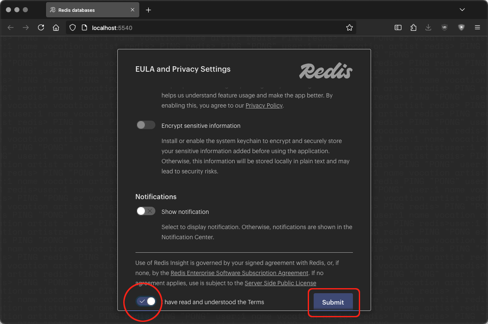

# Using Redis Insight

One of the services provided with PBot is Redis Insight. Redis Insight is a GUI for the Redis database at the center of PBot. To access Redis Insight, navigate to localhost:5540 in your browser.

[Redis.io Official Insight Docs](https://redis.io/docs/latest/develop/tools/insight/)

[Download at redis.io/insight](https://redis.io/insight/)

## EULA

<figure markdown="span">
	
	<figcaption>
	EULA
	</figcaption>
</figure>

## Add a Redis Database

Click the Add Redis database button.

<figure markdown="span">
	
	<figcaption>
		Add Redis Database
    </figcaption>
</figure>

### Setting the Database URL

The connection URL you’ll use to connect to Redis is simply: redis:6379

<figure markdown="span">
	
	<figcaption>
		Add a Database
    </figcaption>
</figure>

## Connecting to the Database

Click on the newly registered database on port 6379.

<figure markdown="span">
	
	<figcaption>
		Your Connected Database
    </figcaption>
</figure>

### Greeting the Key Value Store

Initially, you’ll see an unorganized dump of every key currently in PBot’s database.

For now, we start by looking at the test message sent in the previous section:

“I sure could go for some tacos right now..”

The message will be a JSON record with a key that starts with message: like: message:1414723334960320743

<figure markdown="span">
	
	<figcaption>
		Default Empty Applications Page
    </figcaption>
</figure>

### Finding Our Test Message

The bot’s response will be a HASH record with a key that starts with response:. In this case: response:taco1757366727.626616

<figure markdown="span">
	
	<figcaption>
		Our First Test Message
    </figcaption>
</figure>

### Finding Our Test Response

Redis Insight is pretty straightforward. A better understanding of PBot’s inner workings and the models involved will make navigating Redis Insight ever more intuitive.

<figure markdown="span">
	
	<figcaption>

Taco Lover’s Response

    </figcaption>

</figure>

Redis Insight is pretty straightforward. A better understanding of PBot’s inner workings and the models involved will make navigating Redis Insight ever more intuitive.

## Additional Insight Resources

- [Redis Insight Official Docs](https://redis.io/docs/latest/develop/tools/insight/)
- [Redis Insight Official Docs: Overview](https://redis.io/docs/latest/develop/tools/insight/#overview) - Provides an intro to navigating Redis Insight.
- Download at [redis.io/insight](https://redis.io/insight/)
