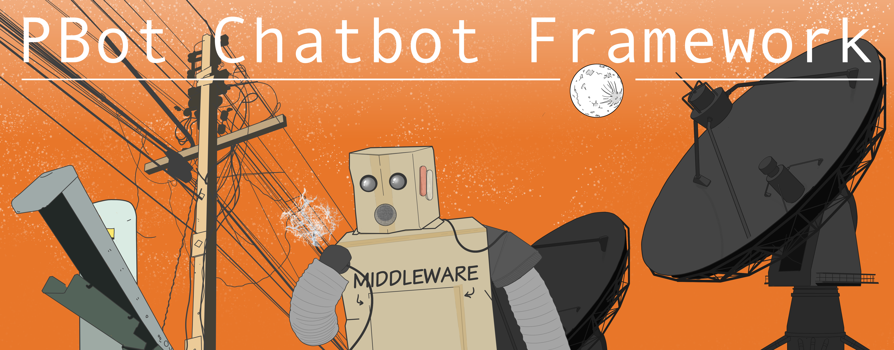

!!! info "1.0 Release Coming Sep 2025!"

    PBot is about to undergo a large update to v1.0 from the current version:
    --8<-- "version"

# PBot

PBot is a minimal and unopinionated Dockerized framework for building chatbots
on Discord that can run on as little as a Raspberry Pi.
It means to abstract away everything but the fun parts of building a chatbot.

## Who is this Project Meant for?

Anyone who wants to set up a private bot with minimal fuss. PBot is a
very simple platform, limited only by your imagination. PBot is optimized for ease of use
and experimentation; it only requires a basic understanding of Python to modify.
There is no need for fancy hosting; you can run a fleet of them on a spare
Raspberry Pi.

## Is this Related to AI?

The earliest version of PBot relied on OpenAI's API (ChatGPT) to provide
automated chaos and amusing insults in friends' private Discord servers.
While PBot ships with an optional ChatGPT middleware for demonstration
purposes, it's not enabled by default and is not necessary for using PBot.
