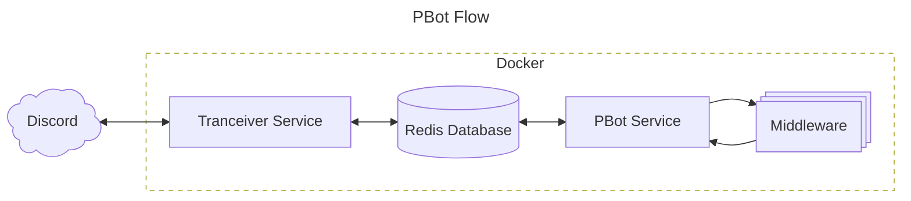

# Project Overview

PBot is a Dockerized application consisting of two primary services:
a **Transceiver service** that communicates with Discord and a **Bot service** that runs the middleware logic.



PBot is built around the idea of middleware, similar to many MVC-style web frameworks. PBot's goal is to push the boring details of writing a chatbot to the periphery, allowing the developer to focus solely on the core logic of their bot within the middleware paradigm.
## Middleware

Middleware is a stack of one or more modules that each can, in turn, act on the
message history passed to it.
Each layer may modify the history passed to it before passing it to the next.

Middleware, at a minimum, is just a single Python class that inherits
from `pbot.middleware.base.Middleware`.
Creating your own only requires that you implement a single
method, `handle_messages()`.
This method must accept a list of messages and return a list.
What your middleware does with the messages or the list itself before
passing it on is entirely up to you.

## Project Structure

```text
pbot/
├─ docs/
├─ services/
│  ├─ bot/
│  │  ├─ src/
│  │  │  ├─ pbot/
│  │  │  │  ├─ middleware/
│  │  │  │  │  └─ base.py (Abstract class all middleware inherit)
│  │  │  │  ├─ bot.py (PBot class)
│  │  │  │  ├─ constants.py
│  │  │  │  ├─ logger.py
│  │  │  │  └─ utils.py
│  │  │  ├─ app.py
│  │  │  └─requirements.txt
│  │  └─ Dockerfile (Docker entry point)
│  └─ transceiver/
│     ├─ src/
│     │  ├─ transceiver/
│     │  │  ├─ constants.py
│     │  │  ├─ logger.py
│     │  │  ├─ models.py
│     │  │  ├─ process_mgs.py (Logic for storing and sending message)
│     │  │  └─ utils.py
│     │  ├─ app.py (Docker entry point)
│     │  └─ requirements.txt
│     └─ Dockerfile
├─ docker-compose.yaml
├─ example.env (Template for .env)
├─ LICENSE
├─ README.md
├─ requirements.txt
└─ version
```
