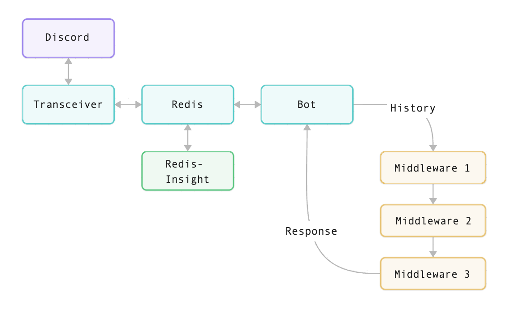

PBot Overview
#############

This document provides a high-level overview of PBot. The project is lightweight and relatively simple, but good documentation is often the first barrier to entry for adopting any open-source project.

========
Services
========

PBot is a Dockerized application with multiple running services:

- Transceiver
- Bot
- Redis
- Redis-Insight

Transceiver Service
-------------------
A lightweight, event-driven service meant to transmit responses to and from Discord. If you don't need to modify the models stored in Redis, you won't need to delve into the transceiver service.

Bot Service
-----------
The bot proper constantly scans for new messages stored in Redis and submits message history through the middleware stack.

Redis
-----
In-memory data store between the bot and the transceiver service.

Redis-Insight
--------------
Provides a local GUI for the Redis service.

==================
Middleware
==================
Middleware is a stack of one or more modules that each can, in turn, act on the message history passed to it. Each layer may modify the history passed to it before passing it to the next.

Middleware, at a minimum, is just a single Python class that inherits from `pbot.middleware.base.Middleware <api-middleware-base.html>`_.
Creating your own only requires that you implement a single method, ``handle_messages()``.
This method must accept a list of messages and return a list.
What your middleware does with the messages or the list itself before passing it on is entirely up to you.

.. note::
   The order middleware is loaded matters.

.. warning::
   When authoring middleware and mutating the message history, consider clean up like marking removed messages as read.

=================
Project Structure
=================

Outlined below are the key files and folders of the project.

.. raw:: html
   :file: _static/overview/dir-structure.html
