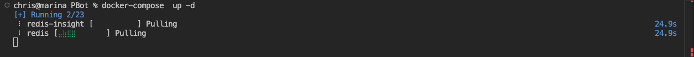
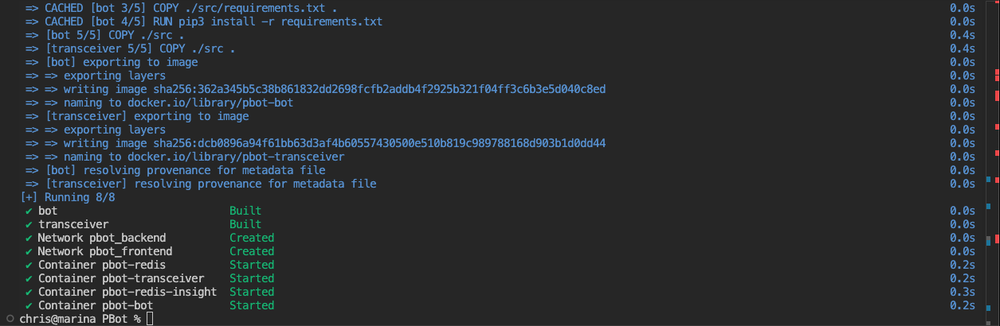
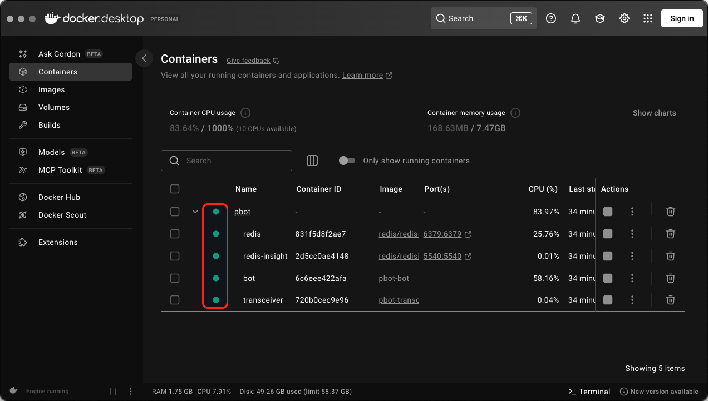
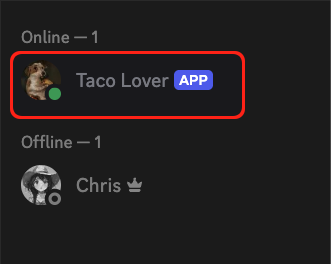
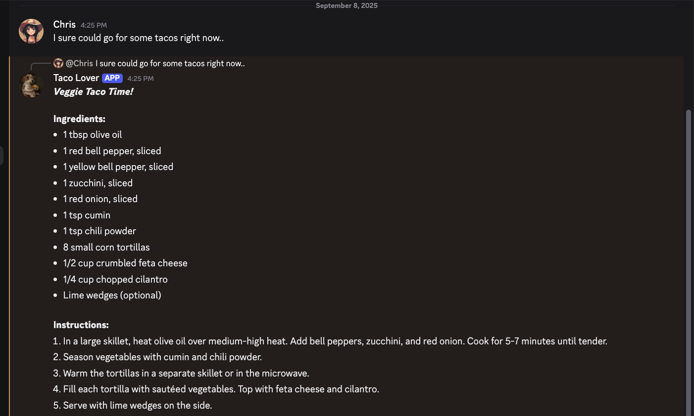

Getting PBot Running
#############################################

================
Install Docker
================

PBot has several moving parts and dependencies. To make PBot easy to use and run consistently across devices, it's bundled as a Docker application. Docker is the only dependency you'll need to install to run PBot.

What is Docker?
----------------

Docker is a tool that allows software and any required services to run inside a sandboxed, containerized environment. This means the application is packaged with everything it needs, including databases, libraries, and any other necessary components.

Downloading Docker
---------------------

At a minimum, you'll need `Docker <https://docs.docker.com/get-started/get-docker/>`_, the command-line tool. Optionally, you can also install `Docker Desktop <https://www.docker.com/products/docker-desktop/>`_, a GUI for managing Docker containers.

-----

=======================
Download PBot
=======================

Visit the official PBot GitHub page, `github.com/chriscummings/PBot <https://github.com/chriscummings/PBot>`_, or directly download a `zipped copy of the code <https://github.com/chriscummings/PBot/archive/refs/heads/main.zip>`_.

-----

======================================
Configuring PBot for its First Run
======================================

Set Your Discord Application Token
--------------------------------------

It's common practice to store sensitive data, such as passwords or API keys, in environment variables instead of hard-coding them into the application.

An environment variable is simply a piece of data stored in memory while a program is running. An application can access the data without having to write it to disk. This keeps secrets out of the source code, limiting the risk of accidentally exposing them when sharing code or storing it in version control.

This data, initially at least, must be recorded somewhere. This place is a special file conventionally named ``.env``.

In the root directory of PBot is a file named ``example.env``. Create a copy of this file next to the original and rename it ``.env``.

.. important::
   Renaming ``example.env`` to ``.env`` may cause the file to disapear depending on your operating system.
   Filenames starting with a dot are conventionally understood to be hidden system files and many operating systems
   hide these files by default.

   - To show hidden files in OSX, press: Shift + Command + .

   - To show hidden files in Windows 10+, press: Ctrl + Shift + .

   - To show hidden files in most flavours of Linux, press: Ctrl + H

-----

Create a copy of the file ``example.env`` with the filename ``.env``.

.. raw:: html
   :file: _static/running-pbot/dir-structure-dot-env.html

-----

Replace the ``???`` with the secret application token provided by Discord.

.. raw:: html
   :file: _static/running-pbot/dot-env-file-code-1.html

----

.. raw:: html
   :file: _static/running-pbot/dot-env-file-code-2.html

----

=================================
Running PBot
=================================

Navigate to the root directory of PBot and execute the following command:

.. raw:: html
   :file: _static/running-pbot/compose-cmd.html

The ``-d`` parameter signals to Docker that the session should be detached.
This way, you can close the terminal without also closing the running Docker application.

-----

Docker will pull down the required Docker images needed for PBot. The process may take a few minutes to complete.

   Docker Pulling Images

----

Once the prerequisites are downloaded and the application built, four services should be listed as ``started``.

   Successful Launch

-----

If you have Docker Desktop installed, you will see a green indicator for all four services.

   All Services Running on Docker Desktop

-----

At this point, if you check your Discord server, your bot should be listed as logged in.

   A Live Bot

-----

You can test it by any mention of the word 'taco.'

   Taco Time!

Congratulations, your instance of PBot is running.
