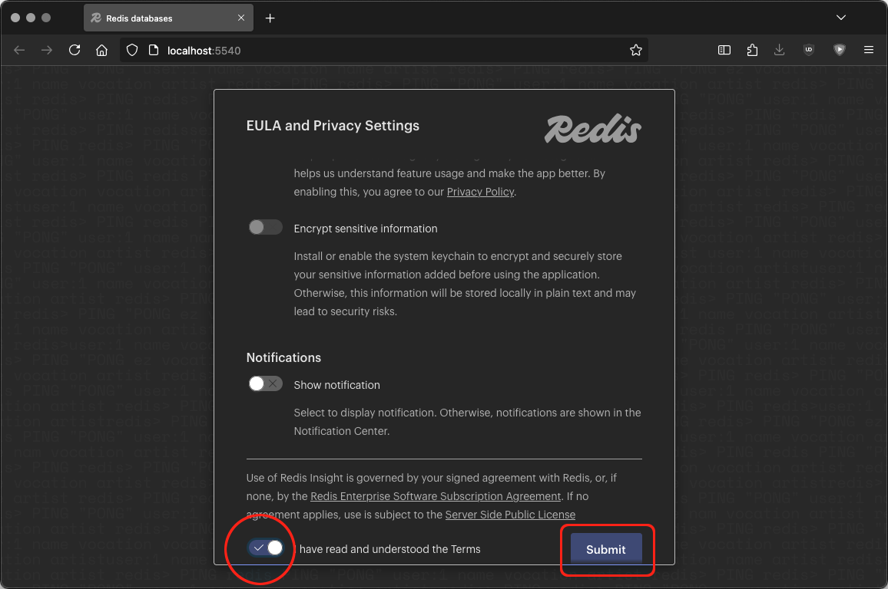
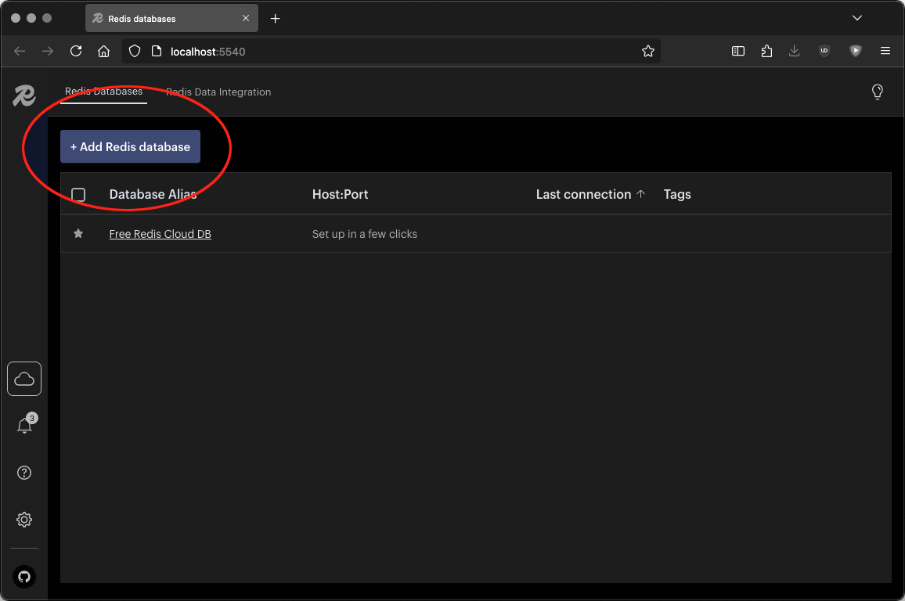
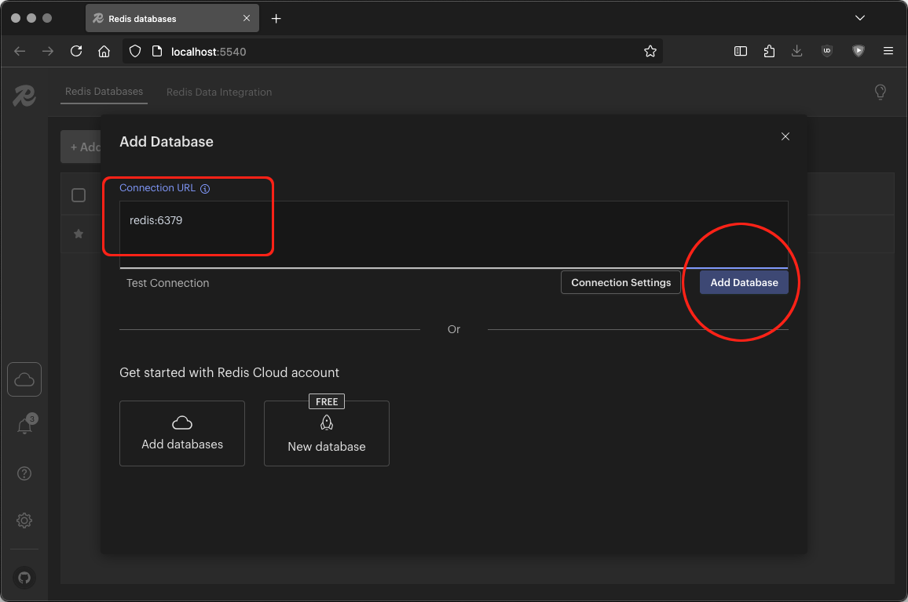
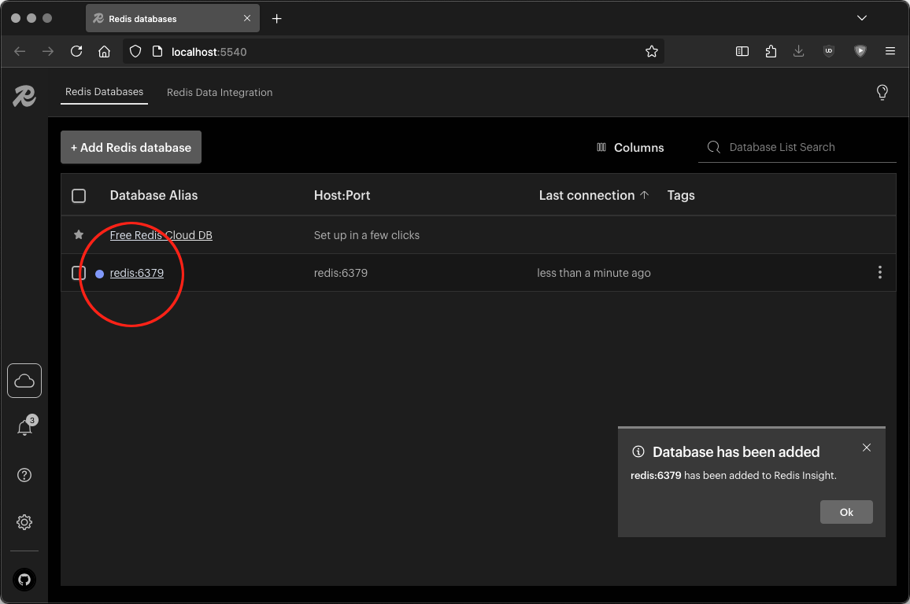
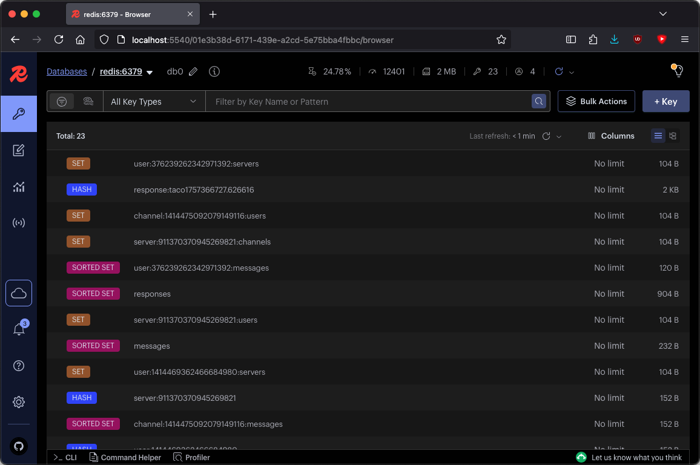
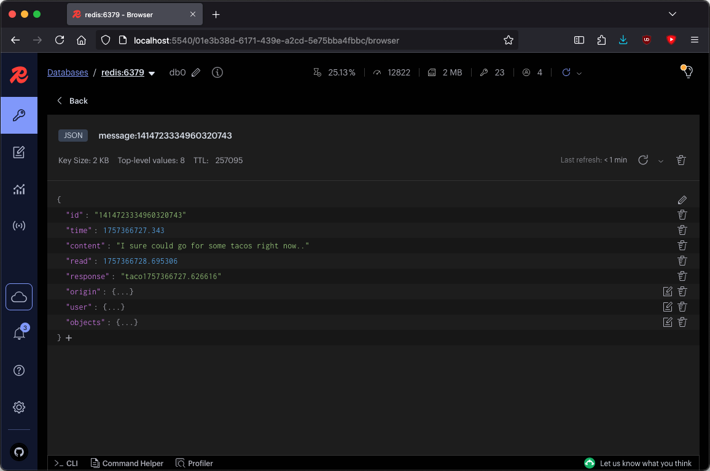
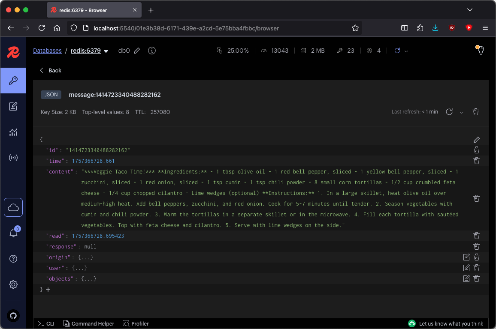

Using Redis Insight
#####################

One of the services provided with PBot is Redis Insight. Redis Insight is a GUI for the Redis database at the center of PBot.
To access Redis Insight, navigate to ``localhost:5540`` in your browser.

-----

The only Slider you have to accept is that you've read and understood the Terms and Conditions.

   EULA

-----

Click the **Add Redis database** button.

   Zero Databases Listed

-----

The **connection URL** you'll use to connect to Redis is simply: ``redis:6379``

   Add a Database

-----

Click on the newly registered database on port 6379.

   Your Connected Database

----

Initially, you'll see an unorganized dump of every key currently in PBot's database.

   Default Empty Applications Page

-----

For now, we start by looking at the test message sent in the previous section:

"*I sure could go for some tacos right now..*"

The message will be a JSON record with a key that starts with ``message:`` like: ``message:1414723334960320743``

   Our First Test Message

-----

The bot's response will be a HASH record with a key that starts with ``response:``. In this case: ``response:taco1757366727.626616``

   Taco Lover's Response

----

Redis Insight is pretty straightforward. A better understanding of PBot's inner workings and the models involved will make navigating Redis Insight ever more intuitive.
